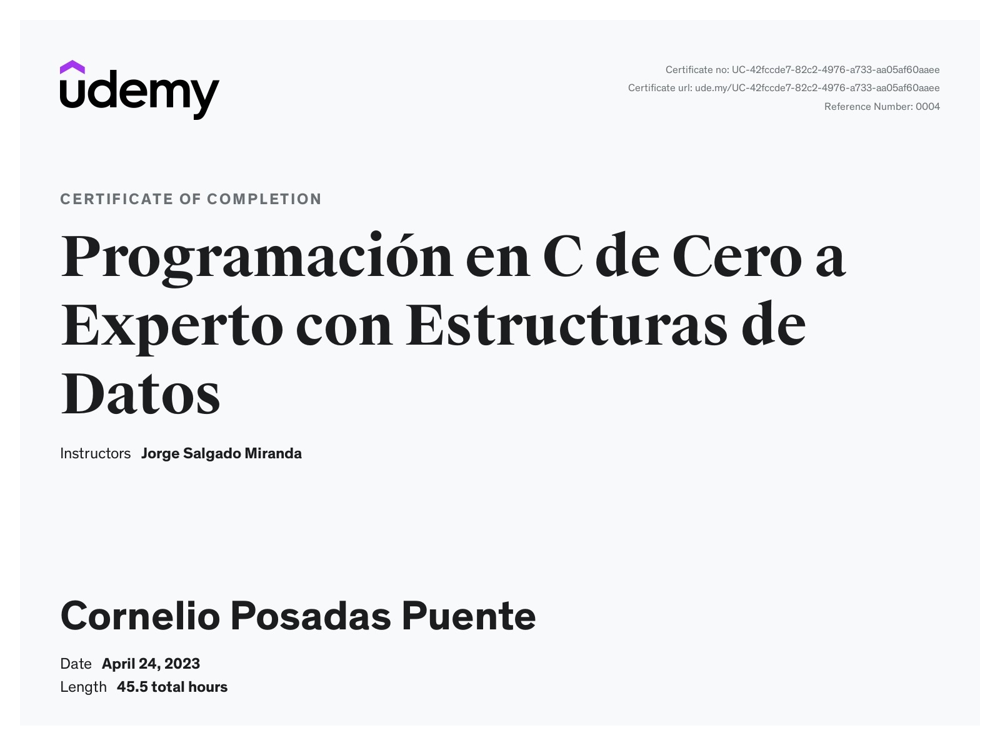

# C-Programming-Course

Udemy Course C programming with data structures

### Helpful blogs
- [Learn C programming](https://www.tutorialspoint.com/cprogramming/c_decision_making.htm)

## Sections

- [1_Operations and expressions](https://github.com/corbridge/C-Programming-Course/tree/main/1_Operations_and_expressions)
- [2_Conditionals](https://github.com/corbridge/C-Programming-Course/tree/main/2_Conditionals)
- [3_Loops](https://github.com/corbridge/C-Programming-Course/tree/main/3_Loops)
- [4_String library](https://github.com/corbridge/C-Programming-Course/tree/main/4_string_h)
- [5_Functions](https://github.com/corbridge/C-Programming-Course/tree/main/5_Functions)
- [6_Arrays](https://github.com/corbridge/C-Programming-Course/tree/main/6_Arrays)
- [7_Structures](https://github.com/corbridge/C-Programming-Course/tree/main/7_Structures)
- [8_Pointers](https://github.com/corbridge/C-Programming-Course/tree/main/8_Pointers)
- [9_File_IO](https://github.com/corbridge/C-Programming-Course/tree/main/9_File_IO)
- [10_Strings](https://github.com/corbridge/C-Programming-Course/tree/main/10_Strings)
- [11_Headers](https://github.com/corbridge/C-Programming-Course/tree/main/11_Headers)
- [12_Project](https://github.com/corbridge/C-Programming-Course/tree/main/12_bills_checker_project)
- [13_Dynamic and static memory](https://github.com/corbridge/C-Programming-Course/tree/main/13_Dynamic_static_memory)
- [14_Order algorithms](https://github.com/corbridge/C-Programming-Course/tree/main/14_Order_algorithms)
- [15_Search algorithms](https://github.com/corbridge/C-Programming-Course/tree/main/15_search_algorithms)
- [16_Typedef](https://github.com/corbridge/C-Programming-Course/tree/main/16_typedef)
- [17_Stack](https://github.com/corbridge/C-Programming-Course/tree/main/17_stack)
- [18_Queue](https://github.com/corbridge/C-Programming-Course/tree/main/18_queue)
- [19_Linked list](https://github.com/corbridge/C-Programming-Course/tree/main/19_linked_list)
- [20_Trees](https://github.com/corbridge/C-Programming-Course/tree/main/20_tree)
- [21_Graphs](https://github.com/corbridge/C-Programming-Course/tree/main/21_graphs)

## Udemy Certificate
